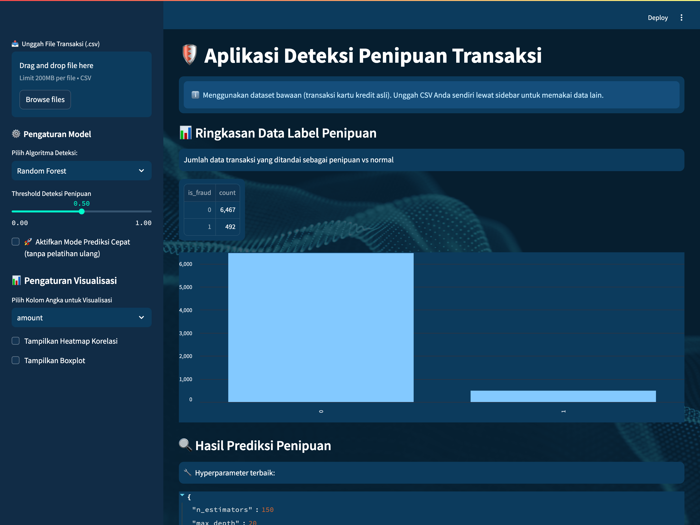
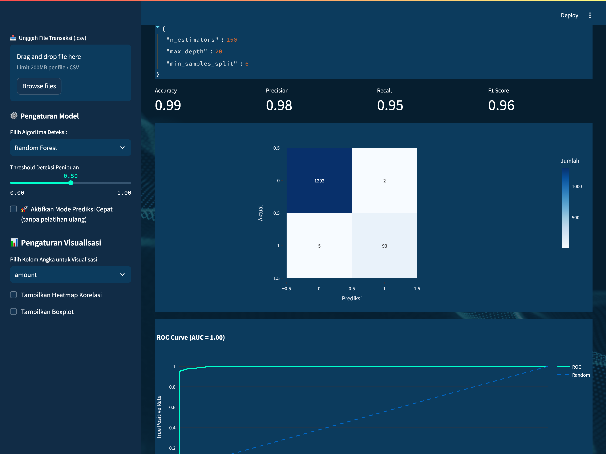
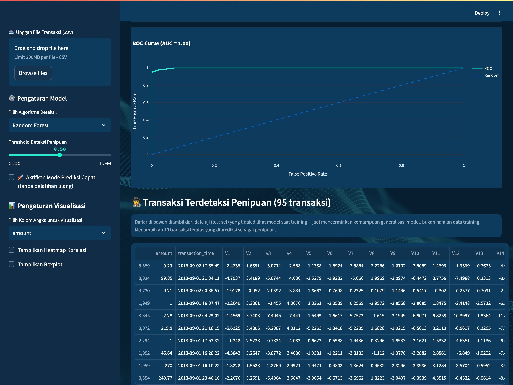
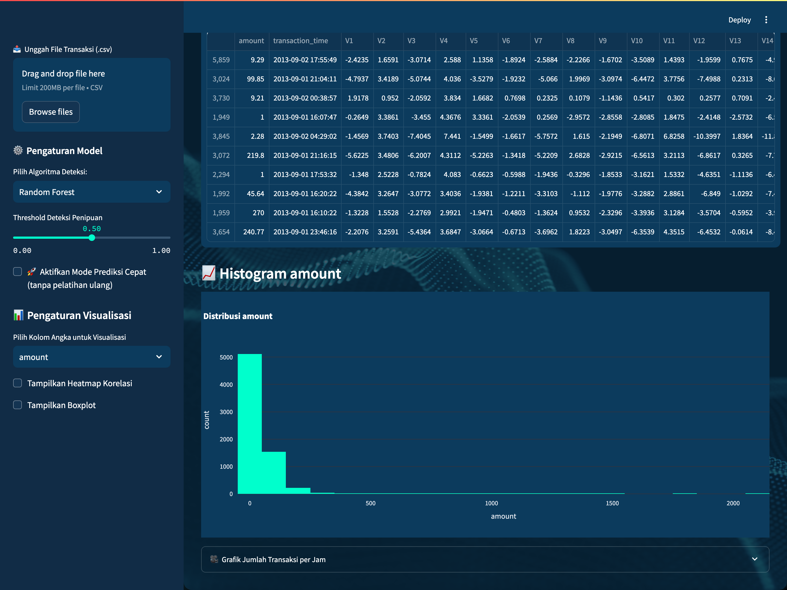
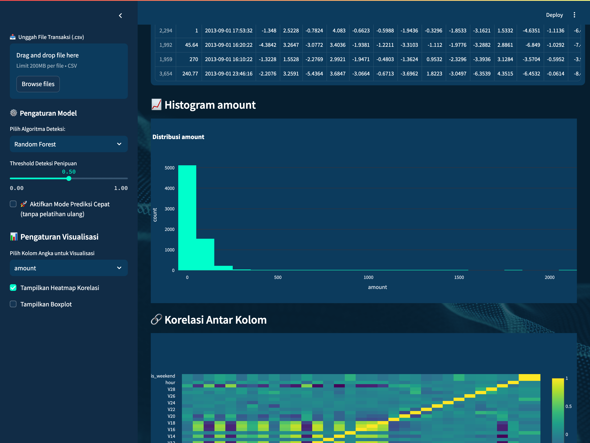

# 🛡️ Financial Fraud Detection Dashboard

🚀 Proyek ini adalah pipeline machine learning lengkap untuk mendeteksi transaksi keuangan yang berpotensi sebagai penipuan, dengan tampilan dashboard Streamlit yang futuristik dan interaktif.

---

## 🔍 Fitur Utama

- ✅ Pembersihan data: menangani nilai hilang dan outlier dengan metode IQR  
- ⚙️ Rekayasa fitur: encoding, normalisasi, dan ekstraksi fitur waktu  
- 🧠 Prediksi ML: pilihan model Random Forest, XGBoost, LightGBM, CatBoost, deteksi anomali (Isolation Forest / One-Class SVM), serta AutoML (PyCaret, opsional)  
- ⚖️ Penanganan data tidak seimbang: SMOTE hanya pada data train (bebas kebocoran/leakage)  
- 📊 Visualisasi: histogram, heatmap, boxplot, animasi volume transaksi  
- 🌌 Tampilan UI modern futuristik: tema warna `#0C3B5D` dan latar kustom  
- 🧪 Evaluasi model: akurasi, presisi, recall, F1 score, ROC curve

---

## 📁 Struktur Folder

financial-fraud-detection-dashboard/
├── data/
│ ├── creditcard_fraud_real_sample.csv   # dataset bawaan (dipakai app secara default)
│ └── creditcard_fraud_real_full.csv     # dataset lengkap (arsip)
├── preprocessing/
│ ├── pipeline.py
│ ├── cleaning.py
│ └── feature_engineering.py
├── assets/
│ └── background_UI-ml1.png
├── app.py
├── requirements.txt
├── requirements-automl.txt
└── .gitignore


---

## 📂 Dataset

Aplikasi ini memakai dataset **Credit Card Fraud Detection (ULB)** -- 284.807
transaksi kartu kredit nyata dari nasabah bank di Eropa (September 2013), dengan
492 transaksi penipuan. Kolom `V1`–`V28` adalah hasil transformasi PCA (disamarkan
demi kerahasiaan), ditambah `amount`, `transaction_time`, dan label `is_fraud`.

- `data/creditcard_fraud_real_sample.csv` — versi ringkas (12.492 baris, semua 492
  fraud + 12.000 transaksi normal). **Dipakai app secara default** supaya training
  interaktif tetap cepat. Sudah ikut di repo.
- `data/creditcard_fraud_real_full.csv` — versi lengkap (284.807 baris). Tidak ikut
  di repo karena ukurannya ~107 MB (di atas limit file GitHub); unduh sendiri dari
  sumber di bawah.

### ⬇️ Download dataset

- **Sumber resmi (Kaggle):** https://www.kaggle.com/datasets/mlg-ulb/creditcardfraud
- **Unduh langsung CSV lengkap (tanpa login):**
  https://raw.githubusercontent.com/nsethi31/Kaggle-Data-Credit-Card-Fraud-Detection/master/creditcard.csv

  ```bash
  # unduh dataset lengkap langsung ke folder data/
  curl -L -o data/creditcard.csv \
    https://raw.githubusercontent.com/nsethi31/Kaggle-Data-Credit-Card-Fraud-Detection/master/creditcard.csv
  ```

  Catatan: file dari sumber di atas memakai kolom asli `Time`, `V1`–`V28`, `Amount`,
  `Class`. App mengharapkan `transaction_time`, `amount`, dan `is_fraud`, jadi ganti
  nama kolomnya (`Class` → `is_fraud`, `Amount` → `amount`, `Time` → `transaction_time`)
  sebelum dipakai, atau langsung pakai `data/creditcard_fraud_real_sample.csv` yang
  sudah disesuaikan.

Untuk memakai data sendiri, cukup unggah file CSV lewat panel di sidebar kiri
(harus punya kolom `is_fraud`; kolom `transaction_time` dan `amount` opsional
tapi dianjurkan).

---

## 🧪 Teknologi yang Digunakan

- Python, pandas, numpy, scikit-learn  
- XGBoost, LightGBM, CatBoost, imbalanced-learn (SMOTE), Optuna  
- Streamlit, Plotly, joblib

---

## 🏁 Cara Menjalankan

```bash
git clone https://github.com/arielshakaramiro/financial-fraud-detection-dashboard
cd financial-fraud-detection-dashboard
pip install -r requirements.txt
streamlit run app.py
```

Browser akan otomatis terbuka ke `http://localhost:8501`. Tanpa upload apa pun, app
langsung memakai dataset bawaan (transaksi kartu kredit asli) sehingga hasilnya bisa
langsung dilihat. Panduan setup lebih detail ada di [`SETUP.md`](SETUP.md).

---

## 📸 Dokumentasi Dashboard

Dashboard dijalankan dengan dataset bawaan (Random Forest, threshold 0.5). Alur di
bawah menunjukkan proses dari pemuatan data sampai hasil deteksi dan visualisasi.

### 1. Tampilan Utama & Ringkasan Data

Saat dibuka, app langsung memuat dataset, membersihkannya, lalu menampilkan ringkasan
label: **6.467 transaksi normal vs 492 penipuan**. Sidebar kiri berisi kontrol untuk
upload CSV, memilih algoritma, mengatur threshold, dan opsi visualisasi.



### 2. Pelatihan Model & Evaluasi

Model dilatih otomatis (Random Forest di-tuning dengan Optuna). Metrik dihitung pada
**test set** (20% data yang tidak dilihat model saat training) supaya mencerminkan
performa sebenarnya, bukan hafalan:

| Metrik    | Nilai |
|-----------|-------|
| Accuracy  | 0.99  |
| Precision | 0.98  |
| Recall    | 0.95  |
| F1 Score  | 0.96  |

Confusion matrix memperlihatkan model menangkap **93 dari 98** transaksi penipuan di
test set, dengan hanya **2 false positive** — angka yang sangat baik untuk data yang
sangat tidak seimbang (fraud hanya ~7% pada sample, ~0,17% pada dataset penuh).



### 3. ROC Curve & Transaksi Terdeteksi

ROC Curve mencapai **AUC = 1.00** (kurva menempel ke pojok kiri-atas), menunjukkan
kemampuan pemisahan fraud vs normal yang hampir sempurna. Di bawahnya, tabel
menampilkan transaksi nyata dari test set yang diprediksi sebagai penipuan.



### 4. Visualisasi Distribusi

Histogram (dan boxplot opsional) untuk mengeksplorasi distribusi tiap kolom numerik,
plus grafik animasi jumlah transaksi per jam.



### 5. Heatmap Korelasi

Heatmap korelasi antar kolom untuk melihat hubungan antar fitur.



> **Catatan hasil:** Angka di atas diperoleh dari dataset bawaan (versi sample). Karena
> data ini punya pola fraud yang nyata, model mencapai performa tinggi. Bandingkan
> dengan versi lama yang memakai data acak — di sana precision/recall = 0 karena tidak
> ada pola untuk dipelajari. Ini menegaskan pipeline-nya jujur: skor tinggi hanya
> muncul ketika datanya memang punya sinyal fraud.

### Ringkasan performa semua model (test set, dataset sample)

| Model                    | F1 Score | ROC AUC |
|--------------------------|----------|---------|
| Random Forest            | 0.96     | 0.998   |
| XGBoost                  | 0.96     | 0.998   |
| LightGBM                 | 0.96     | 0.998   |
| CatBoost                 | 0.96     | 0.998   |
| Isolation Forest (anomali) | unsupervised | — |
| One-Class SVM (anomali)    | unsupervised | — |

